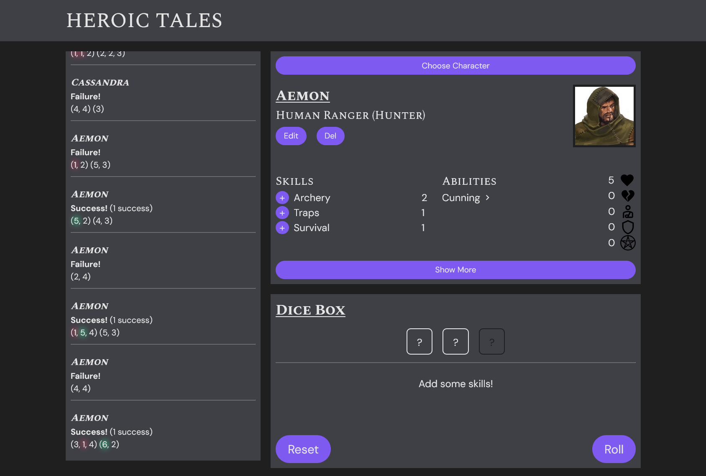
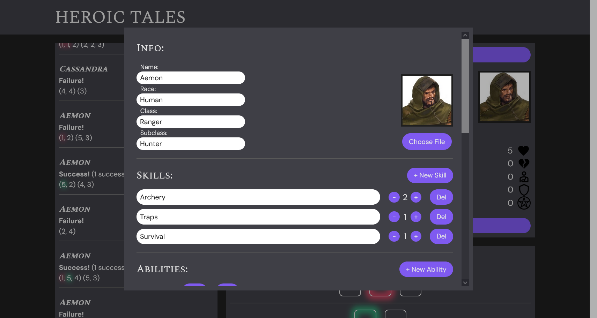
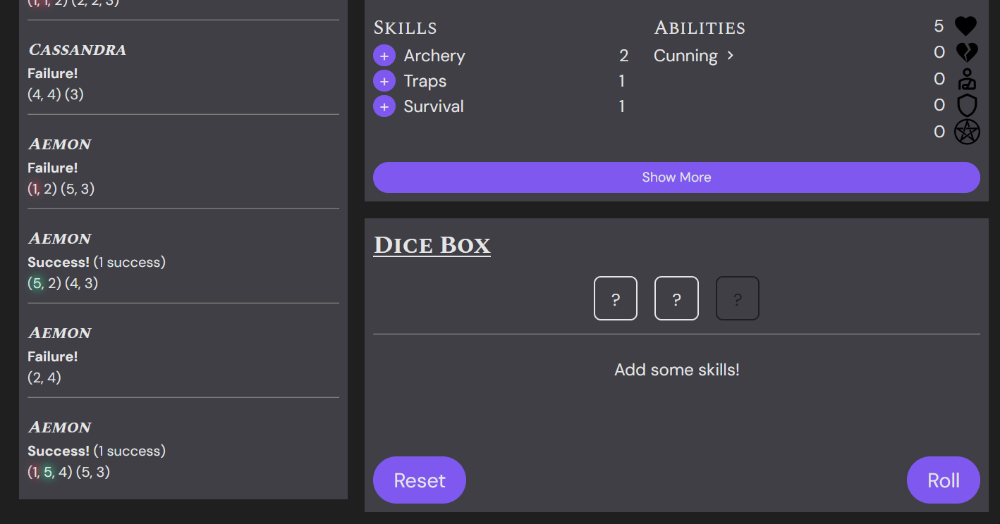

# Heroic Tales App

A full-featured digital companion, built with React, for the tabletop RPG [Heroic Tales](https://squidhead-games.itch.io/heroic-tales) by [Squidhead Games](https://squidhead-games.itch.io/). Includes everything you need to run a session — from character sheets to dice rolling and result tracking.

**Live project**: [https://heroic-tales-app.netlify.app](https://heroic-tales-app.netlify.app)

## Features

- Builds dice pools dynamically by adding relevant skills directly from your character sheet.
- Editable character sheets with an accordion-style layout
- A log of previous rolls, with clear success/failure highlighting
- Automatic saving of character data in local storage

## Background

This project started as a way to push my React skills and to take a project from an idea all the way to production. I wanted to practice:

- Breaking a UI down into clean, reusable components
- Working with state and browser storage
- Creating a simple, immersive interface that’s also accessible and responsive

## Tech Stack

- **React** (via Vite)
- **styled-components** for scoped component styling
- **Headless UI** for accessible modals/dialogs
- Local state and localStorage for persistent storage
- Deployed on **Netlify**

## Screenshots

App in full:

Character Editor:

Dice Roll Example:

## Getting Started

Clone the repo:

    git clone git@github.com:gemini-mastiff/heroic-tales-app.git
    cd heroic-tales-app

Install the dependencies:

    npm install

Run the development server:

    npm run dev

## Future Improvements

This is an ongoing project. Some things I plan to improve:
- Mobile-optimized responsive layout
- Refactoring for cleaner, more modular code
- In-app character image editing
- Refined styling for improved UX

## Credits

This app is a fan-made tool built for [Heroic Tales](https://squidhead-games.itch.io/heroic-tales) by [Squidhead Games](https://squidhead-games.itch.io/).  
All credit for the game design goes to them.

## 🔗 GitHub + Contact

- Source code: [github.com/gemini-mastiff/heroic-tales-app](https://github.com/gemini-mastiff/heroic-tales-app)
- Feel free to open issues or suggestions — always happy to get feedback!
